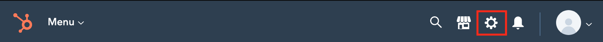
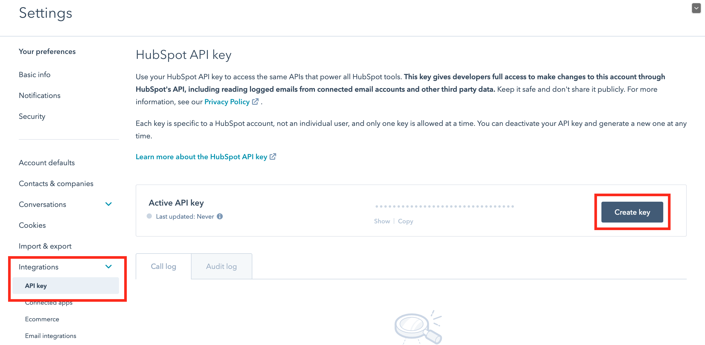
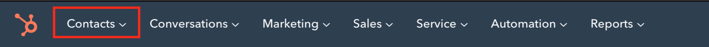
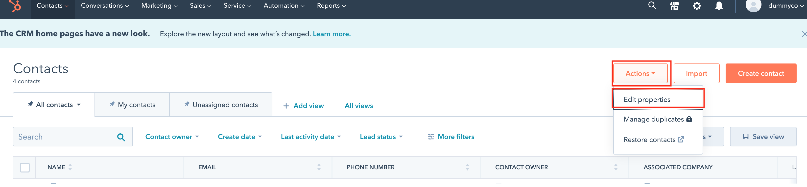
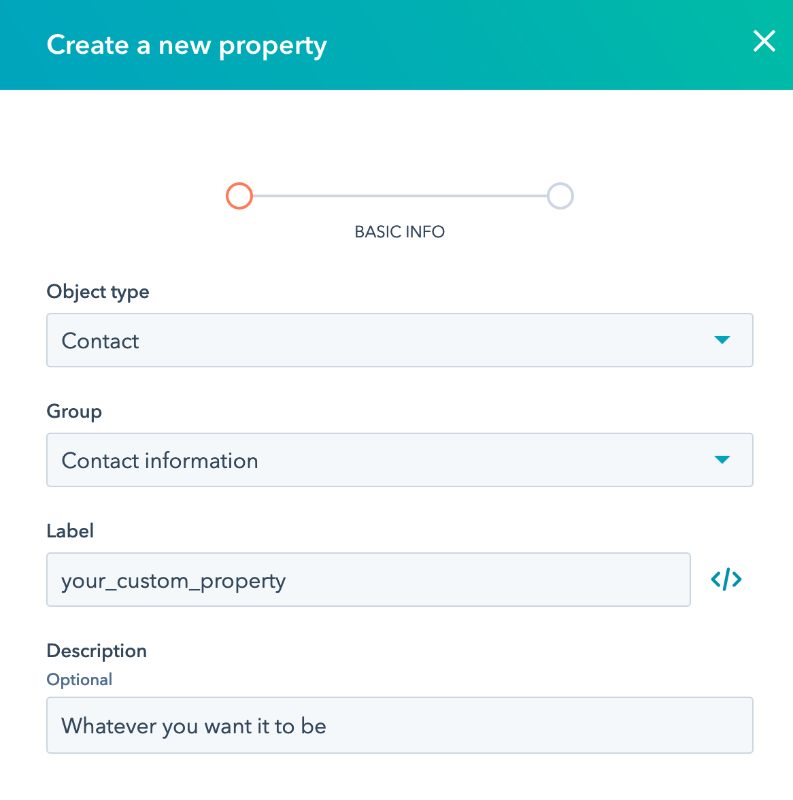

# Create a Chat Widget that Automatically Generates Contact info in Hubspot

In this tutorial, learn how to build a [Stream](https://getstream.io) chat widget that connects to the Hubspot CRM to automatically create a new contact when a customer initiates a chat. This widget, backed by the [Stream chat API](https://getstream.io/chat/docs/?language=js), can be easily embedded to your site as a chat widget for sales, support, or a landing-page. You can take this knowledge to build powerful sales tools that seamlessly integrate with the Hubspot API.

The frontend of this application includes a simple user registration form that takes in a name and email and starts a chat with a customer representative. The backend records the potential customer's name and email in a Hubspot Dashboard, and sets up a private chat app for the customer and a support representative.

## Overview

The application utilizes a [React](https://reactjs.org/) `frontend` and an [Express](https://expressjs.com/) `backend`. The tutorial explains how to use some basic features of the powerful [Stream Library](https://getstream.io/), which handles most of creating a chat widget.

The code required for this tutorial is available in [GitHub](https://github.com/isaidspaghetti/stream-hubspot-contacts). If you'd like to build the app from scratch, use `npm express generator --no-view` for the backend, and `create-react-app` for the frontend. Be sure to use the `package.json` file from this repository to get the required dependencies loaded in your version. Otherwise, you can clone the repo from GitHub and follow along.

## Prerequisites

This tutorial is written to work with a wide range of skillsets. It requires basic knowledge of [React Hooks](https://reactjs.org/docs/hooks-intro.html), [Expres](https://expressjs.com/), and [Node.js](https://nodejs.org/en/). The code is built and run with the [Node Package Manager](https://www.npmjs.com/get-npm), and is made to run locally. We also use [dotenv](https://www.npmjs.com/package/dotenv).

 You'll need to set up a free [Stream Account](https://getstream.io/get_started/?signup=#flat_feed) and a free [Hubspot Account](https://app.hubspot.com/signup/crm/step/user-info?hubs_signup-cta=getstarted-crm&hubs_signup-url=www.hubspot.com%2Fproducts%2Fget-started).

### Not Covered

* We'll create a Stream Client and register a user with a chat channel, but we won't specifically describe how to set up administrative accounts. We'll focus primarily on the potential customer's experience.
* We won't explore notifying a customer representative when a chat is initiated.
* Styling and CSS: this app uses the excellent out-of-the-box styling of Stream. Check out Stream's awesome [free UI Kit](https://getstream.io/chat/ui-kit/) to make your chat app shine ✨.
* Encryption or Authentication. To add some more security to your app, check out [this post](https://getstream.io/blog/hipaa-chat/), which shows how to authenticate users and encrypt messages.

## What We'll Do

* Set up a free Hubspot account, activate a key
* Set up a free Stream account, activate a key
* Create a React user form with first name, last name, and email
* Use an Express backend to:
    1. Send user form data to your Hubspot Dashboard
    2. Create a one-on-one, private Stream Chat [Channel](https://github.com/isaidspaghetti/stream-hubspot-contacts)
    3. Respond to the frontend with required [credentials](https://github.com/isaidspaghetti/stream-hubspot-contacts) to join
* Join and load the specified Chat in the frontend using Stream's built-in UI Components.

## Let's Get Down To Business

First, we need to set up your unique API keys from Hubspot and Stream. These authenticate your app and are to be stored in a secure `.env` file. The Git Repo includes a `.env.example` file you can use as a template. Add your unique keys to this file, then remove '.example' from the file name.

```text
//backend/.env.example
NODE_ENV=development
PORT=8080

STREAM_API_KEY=your stream api key goes here
STREAM_API_SECRET=your stream api secret goes here
HUBSPOT_API_KEY=your hubspot api key goes here
```

### Set-up your Hubspot

1. Create your account at [Hubspot](https://app.hubspot.com/signup/crm/step/user-info?hubs_signup-cta=getstarted-crm&hubs_signup-url=www.hubspot.com%2Fproducts%2Fget-started) and complete the registration form.

2. Once you are logged into the `Hubspot Dashboard,` go to Settings in the upper-right corner



3. Navigate to Integrations > API Key, and create a key. If you're a robot, stop here. You've gone too far...



4. Copy the Hubspot API key and paste it in the `.env` located in the `backend` folder.

<script src="https://gist.github.com/isaidspaghetti/78ab29744d5c3d93d735a1a81d1b83e0.js"></script>

Your Hubspot Account can now be accessed through this API key.

### Set-up your Stream Account

1. Sign up for a [Stream Trial](https://getstream.io/get_started/?signup=#flat_feed).

1. Then to generate a Stream API Key and API Secret, navigate to your [Stream.io Dashboard](https://getstream.io/dashboard/). 


2. Then click on "Create App", and complete the form like in the following screenshot.


3. Give your app a name, select "Development" and click "Submit". 
 


4. Stream will generate a Key and Secret for your app. You need to copy these into your `backend` `.env` file as well.
 


### Spin up the app

1. If you haven't already, run `npm install` on both the `frontend` and `backend` folders.

2. Once your packages are installed, run either `npm start` or `nodemon` on both the `frontend` and `backend` folders. 

## Exposition

Now that you're up and running, let's check out how the app works...

### Registration Form

When opening this app in the browser, the user will see this login form:


The following snippet shows how the registration form is created. We'll ignore the chat app code for now, as indicated with `// ...`. 


```jsx
//frontend/src/App.js:7
function App() {
  const [email, setEmail] = useState('');
  const [firstName, setFirstName] = useState('');
  const [lastName, setLastName] = useState('');
//...
    return (
      <div className="App container">
        <form className="card" onSubmit={register}>
          <label>First Name</label>
          <input
            type="text"
            value={firstName}
            onChange={(e) => setFirstName(e.target.value)}
            placeholder="first name"
          />
          <label>Last Name</label>
          <input
            type="text"
            value={lastName}
            onChange={(e) => setLastName(e.target.value)}
            placeholder="last name"
          />
          <label>Email</label>
          <input
            type="email"
            value={email}
            onChange={(e) => setEmail(e.target.value)}
            placeholder="email"
          />
          <button className="btn btn-block" type="submit">
            Start chat
          </button>
        </form>
      </div>
    );
  }
}

export default App;
```

The simple form above sets up three useStates to update and store the user input fields. The form's `onSubmit` function, `register()`, will post the user credentials to the backend.

### Sending login info to the backend

Let's take a look at the first half of the frontend's `register()` function. The second half of this function handles the response from the backend, which we will cover next. We use an asynchronous await function to give the backend time to do its work before we continue rendering in the frontend, and wrap the work in a try block for error handling. 

 ```jsx
 //frontend/src/App.js:15
 const register = async (e) => {
    try {
      e.preventDefault();
      var response = await fetch('http://localhost:8080/registrations', {
        method: 'POST',
        headers: {
          'Accept': 'application/json',
          'Content-Type': 'application/json',
        },
        body: JSON.stringify({
          firstName,
          lastName,
          email,
        }),
      });
    // ...
    } catch (err) {
        console.error(err)
    }
```

## Now for the Backend API

Let's take a peek at how we handle the backend. When we use `npm start` from the terminal, `backend/package.json` runs `api.js`. `api.js` is set to allow Express to `.use` `backend/routes/index.js` on all requests. In other words: our request from the front end will get routed to `index.js`. (To learn more about how this works, take a peek at [this tutorial](https://developer.mozilla.org/en-US/docs/Learn/Server-side/Express_Nodejs/routes)).

// todo@taylor: the above paragraphi is confusing. I like the idea but let's discuss how to clarify.

### Configure index.js

Before we dive into handling our routes, let's configure `index.js`:

```javascript
//backend/routes/index.js:1
const express = require('express');
const router = express.Router();
const StreamChat = require('stream-chat');
const Hubspot = require('hubspot');
require('dotenv').config();

const apiKey = process.env.STREAM_API_KEY;
const apiSecret = process.env.STREAM_API_SECRET;
```

By requiring and configuring `('dotenv')`, we're able to access the private variables we set up in `.env`. Call these variables using `process.env`. The `('hubspot')` library will make connecting to their API a breeze.

todo@taylor: link to these the appropriate libraries. You also are requiring `stream-chat` here which is confusing since we haven't talked it through yet.

### The primary backend function

When a user registers to start a chat, `router.post('/registrations')` takes over. This handler is our primary backend function, and will call a few handy methods to set up our chat session. Let's review the router function, then step through it to understand it.

#### Backend Registration Endpoint Process Flow

* Call `createHubspotContact()` to create a Hubspot contact
* Call `createUsers()` to create our `customer` and `supporter` chat members
* Register our app as a Stream `client`
* Register (or update) our users with our Stream client using `upsertUsers()`
* Create a private chat `channel` in our `client`
* Create a `customerToken` for the frontend to join said channel
* Respond to the frontend with all required data to start the client in a browser


```javascript
//backend/routes/index.js:46
router.post('/registrations', async (req, res, next) => {
  try {
    await createHubspotContact(firstName, lastName)

    const client = new StreamChat.StreamChat(apiKey, apiSecret);

    [customer, supporter] = createUsers(firstName, lastName)

    await client.upsertUsers([
      customer,
      supporter
    ]);

    const channel = client.channel('messaging', customer.id, {
      members: [customer.id, supporter.id],
    });

    const customerToken = client.createToken(customer.id);

    res.status(200).json({
      customerId: customer.id,
      customerToken,
      channelId: channel.id,
      apiKey,
    });

  } catch (err) {
    console.error(err);
    res.status(500).json({ error: err.message });
  }
});

```

### Hubspot API

The router first creates the Hubspot contact with the `createHubspotContact()` method: 

```javascript
//backend/routes/index.js:10
async function createHubspotContact(firstName, lastName) {
  const hubspot = new Hubspot({
    apiKey: process.env.HUBSPOT_API_KEY,
    checkLimit: false
  })

  const contactObj = {
    properties: [
      { property: 'firstname', value: firstName },
      { property: 'lastname', value: lastName },
      {
        property: 'your_custom_property',
        value: 'anything you want, even a multi-line \n string'
      }
    ]
  }
  const hubspotContact = hubspot.contacts.create(contactObj)
  ```

 The `contactObj` is the argument to Hubspot's awesome `.create()` method. Any Hubspot contact property can be used in `contactObj`. Check out their full list of properties [here](https://legacydocs.hubspot.com/docs/methods/contacts/contact-properties-overview). Note how we used `your_custom_property` as a key. This is certainly optional, the next section shows you how it works.

 ### Bonus: Creating custom contact properties in Hubspot

 To use a custom property follow these steps in your Hubspot Dashboard: 

 1. Navigate to your contacts:



2. Click the 'Actions' drop down menu, then 'Edit Properties':



3. Click the 'Create Property' button and add whatever type of custom fields you'd like to use.



## Stream client registration

Back in the primary router, register the Stream app instance with `new StreamChat.Streamchat()`, passing in our `apiKey` and `apiSecret`.

// todo@taylor: this feels awkard. Either cut or expand on what the client can do. This is just the client initialization code, it doesn't really "register" with stream.

## Client user registration

To keep a chat secure, we can specify which users can use our client. Let's create a `customer` object for our frontend user, and a `supporter` object to represent a sales rep or support rep on the other end of the chat.

```javascript
//backend/routes/index.js:30
function createUsers(firstName, lastName) {
  const customer = {
    id: `${firstName}-${lastName}`.toLowerCase(),
    name: firstName,
    role: 'user',
  };

  const supporter = {
    id: 'adminId',
    name: 'unique-admin-name',
    role: 'admin'
  }
  return [customer, supporter]
}
```

Note the keys included for the users above. Stream supports a myriad of [properties](https://getstream.io/chat/docs/init_and_users/?language=js) you can add to your users, but for this example, we'll simply add an `id`, `name`, and `role`.  

Back in our primary backend function, the `upsertUsers()` method registers both our `customer` and our `support` admin so they can use our app. 

### Create a Stream channel

// todo@taylor: you don't really "register" the client with stream. You configure it with the proper credentials.

Back to the `router.post` function. Now that we have our users registered with Stream, we can open a channel for the two to chat. Stream's `channel()` method first accepts a channel type; `'messaging'` will be the best for this app. // todo@taylor: add link to streams message types

Each channel on your client should have a unique name. We use the customer's email address, so that if the user is disconnected from their chat, they can return to it by entering the same credentials into the registration form.

The `members` argument specifies which users can join this channel. This is not required for the channel, but by specifying the members, we add a layer of privacy. If we leave `members` off the channel is public by default.

### Token and response

Stream provides a quick and easy token generator: `createToken()`. This will be used in the frontend to verify the user. The final response to the frontend includes all information required to load the client in the browser and join the channel specified.

## Let's wrap up with the frontend

Once the backend is finished, the frontend needs to:

* Decompose the response (line 31)
* Join the Stream client using the `apiKey` (line 32)
* Establish the browser's user using the `customerToken` (line 33)
* Join the specific channel using the `channelId` (line 40)
* Render the Stream Chat (line 49)

```jsx
//frontend/App.js:7
function App() {
  const [email, setEmail] = useState('');
  const [firstName, setFirstName] = useState('');
  const [lastName, setLastName] = useState('');

  const [chatClient, setChatClient] = useState(null);
  const [channel, setChannel] = useState(null);

  const register = async (e) => {
    try {
      e.preventDefault();
      var response = await fetch('http://localhost:8080/registrations', {
        method: 'POST',
        headers: {
          'Accept': 'application/json',
          'Content-Type': 'application/json',
        },
        body: JSON.stringify({
          firstName,
          lastName,
          email,
        }),
      });
      
      const { customerId, customerToken, channelId, apiKey } = await response.json();
      const chatClient = new StreamChat(apiKey);
      await chatClient.setUser(
        {
          id: customerId,
          name: firstName,
        },
        customerToken,
      )
      const channel = chatClient.channel('messaging', channelId);
      setChatClient(chatClient);
      setChannel(channel)

    } catch (e) {
      console.error(e)
    }
  };

  if (chatClient && channel) {
    return (
      <div className="App">
        <Chat client={chatClient} theme={'messaging light'}>
          <Channel channel={channel}>
            <Window>
              <ChannelHeader />
              <MessageList />
              <MessageInput />
            </Window>
            <Thread />
          </Channel>
        </Chat>
      </div>
    );
  } else {
    return (
      <div className="App container">
        <form className="card" onSubmit={register}>
          <label>First Name</label>
          <input
            type="text"
            value={firstName}
            onChange={(e) => setFirstName(e.target.value)}
            placeholder="first name"
            required
          />
          <label>Last Name</label>
          <input
            type="text"
            value={lastName}
            onChange={(e) => setLastName(e.target.value)}
            placeholder="last name"
            required
          />
          <label>Email</label>
          <input
            type="email"
            value={email}
            onChange={(e) => setEmail(e.target.value)}
            placeholder="email"
            required
          />
          <button className="btn btn-block" type="submit">
            Start chat
          </button>
        </form>
      </div>
    );
  }
}
```

//todo@taylor: this is repetitive with initial code snippet, let's carve it up to focus on what's new.

The responses from the backend are used in the same manner for the frontend. The `chatClient` and `channel` states determine what to render on the page. A lot of the hard work here is done thanks to the Stream Library, which provides each of the components we render once `chatClient` and `channel` are configured. These libraries are easily imported in this file's import block: 

```jsx
//frontend/App.js
import React, { useState } from 'react';
import { Chat, Channel, ChannelHeader, MessageInput, MessageList, Thread, Window, } from 'stream-chat-react';
import { StreamChat } from 'stream-chat';
import './App.css';
import 'stream-chat-react/dist/css/index.css'
```

// todo@taylor: unnecessary

## That's a wrap

So, there you have it: a customizable chat widget that easily pushes user inputs to your Hubspot CRM. Stay tuned for more posts on how to connect Hubspot with agile Stream apps!